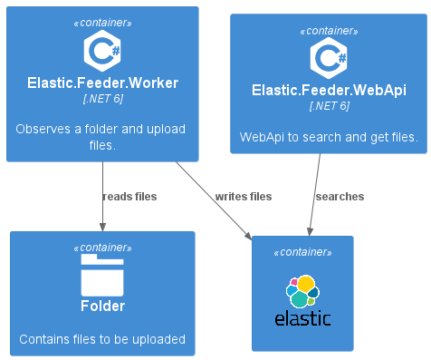
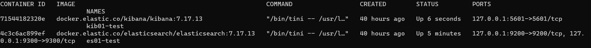
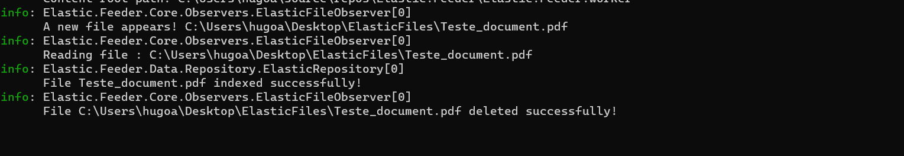
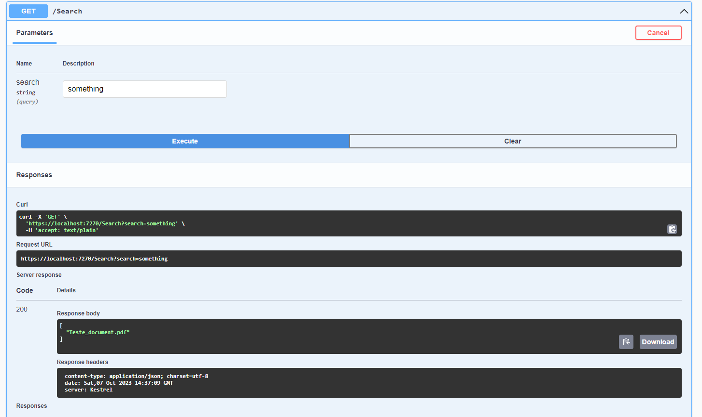

# Elastic.Feeder

## What is Elastic.Feeder?

Elastic.Feeder is a .NET 6 project that is able to index files using elastic search and allow search in the documents content.
It includes a worker that observes a folder and everytime a new file is added to the folder it indexes the file into an elastic search cluster.
In the other hand, the WebApi available allows to search documents by content and download the file.



## Dependencies 

It uses .NET 6 framework and NEST v7.17.5. You may have a docker container running Elastic v7.17.13 and Kibana v7.17.
You will also need to instal the ingest-attachment plugin on elastic. You can check how to do that in the following sections.

## Getting started

### Windows

#### Docker
Make sure you have Docker Desktop installed, otherwise you can download it from  [here](https://www.docker.com/products/docker-desktop/).

#### Elastic 
After having docker up and running, you must pull the elasticsearch v7.17.13 image and run it. Please, follow the official elastic documentation from [here](https://www.elastic.co/guide/en/elasticsearch/reference/7.17/docker.html).

Before moving to the next step, make sure you have your elastic instance running by accessing `http://localhost:9200`.

After having the elastic container running, you must access the container and install the `ingest-attachment` plugin.

```
# cd bin
# elasticsearch-plugin install --batch ingest-attachment
```

For more details, please check the [official documentation page for Ingest Attachment Processor Plugin](https://www.elastic.co/guide/en/elasticsearch/plugins/7.17/ingest-attachment.html)


#### Kibana

Kibana will be helpfull to help us to create the index and the pipeline needed to index files into elastic.

I suggest you to follow the [official documentation page for Kibana v7.17](https://www.elastic.co/guide/en/kibana/7.17/docker.html).

After completed, make sure you can access your Kibana dashboard. Usually, it is available on `http://localhost:5601`.

#### Creating the index and the ingest pipeline

##### Index
In order to be able to upload our files and have a collection of files, we need to create an index. Remember, an **Index** represents a collection of documents.

We can create an index by using the console that Kibana provides at `http://localhost:5601/app/dev_tools#/console`

Please, use the following instruction to create the index *mydocuments*:

```PUT /mydocuments```

You can also check the official documentation [here](https://www.elastic.co/guide/en/elasticsearch/reference/7.17/indices-create-index.html).

##### Ingest pipeline

To setup the ingest pipeline you must access your Kibana instance and navigate to `Stack Management` menu and then navigate to `Ingest Pipelines`. 

There click on **Create pipeline**.

You must give a name to the new Pipeline. In this project the pipeline name is `documents-pipeline`. You can set your own name for this pipeline but you must not forget to change it on app settings of **Elastic.Feeder** projects.

Now that the the pipeline has a name, we you must add a processor to the pipeline.
In order to do that you just need to click on "Add a processor" button.
Search for the `Attachment` processor, if no option is available it will create a new custom processor with that name for you.
On `Configuration` field please add the following JSON:

 ```
{
    "attachment": {
        "field": "data"
    }
}
```

It means that our processor will process the field which name is `data`.

For further information about `ingest pipelines`, please, check the [official documentation](https://www.elastic.co/guide/en/elasticsearch/reference/7.17/ingest.html).

## Configurations

### Worker

In order to run the worker properly, we need to setup the following configurations on `appSettings.json`:
 
```
{
  "ObserverConfiguration": {
    "Folder": "C:\\FolderToObserve",
    "FileTypes": "*.xml,*.json,*.pdf",
    "DeleteLocalFileAfterUpload" : true
  },
  "ElasticsearchConfiguration": {
    "Url": "http://localhost:9200",
    "DocumentsIndex": "mydocuments",
    "DocumentsPipeline": "documents-pipeline"
  }
}
```


- **ObserverConfiguration**
  - **Folder**: Must contain the path to the folder that will be observed by the worker
  - **FileTypes**: Contains the file types that the worker should handle. The default configuration only handles XML, JSON and PDF files. Be free to add more filetypes if you need. If the file type is not defined in the configuration, the file will be ignored.
  - **DeleteLocalFileAfterUpload**: if this setting is `true`, the file that you put in the `Folder` will be deleted after it is indexed in the elastic server. If you don't want to delete the file after it is indexed, please, set the value as `false`.
- **ElasticsearchConfiguration**
  - **Url**: Contains the url of the running instance of elastic search 
  - **DocumentsIndex**: It's the name of the index created where the documents must be indexed
  - **DocumentsPipeline**: It's the name of the `ingest pipeline` that must be used to upload the file


### WebApi

```
{
  "ElasticsearchConfiguration": {
    "Url": "http://localhost:9200",
    "DocumentsIndex": "mydocuments",
    "DocumentsPipeline": "documents-pipeline"
  }
}
```

- **ElasticsearchConfiguration**
  - **Url**: Contains the url of the running instance of elastic search 
  - **DocumentsIndex**: It's the name of the index created where the documents must be added
  - **DocumentsPipeline**: It's the name of the `ingest pipeline` that must be used to process the file


## How to run?

Using a terminal, execute:

1 - Start your docker elastic search container

`docker start {elastic-search-container-name}`

Example:
`docker start es01-test`

2 - Start your docker kibana container
`docker start {kibana-container-name}`

Example:
`docker start kib01-test`

3 - You can check that your containers are running by executing:
`docker container ls`

The result must be something like:


4 - In order to start the worker, go to the worker directory project:

`cd Elastic.Feeder\Elastic.Feeder.Worker`
`dotnet run`

5 - To start the web api, go to the web api directory project:
`cd Elastic.Feeder\Elastic.Feeder.WebApi`
`dotnet run`

You can check the swagger api page by accessing `https://localhost:7270/swagger/index.html`

At this point everything must be running as expected. Let's try it out!

6 - Copy a PDF file to the observed folder. You can see that the worker handles the file in the terminal window:



7 - Use the swagger interface for search. Go to  `https://localhost:7270/swagger/index.html` use the `GET Search` endpoint. For demonstration purpose, search for some words that you know are present in the PDF. It will return which file(s) contains the expression.
Example:


